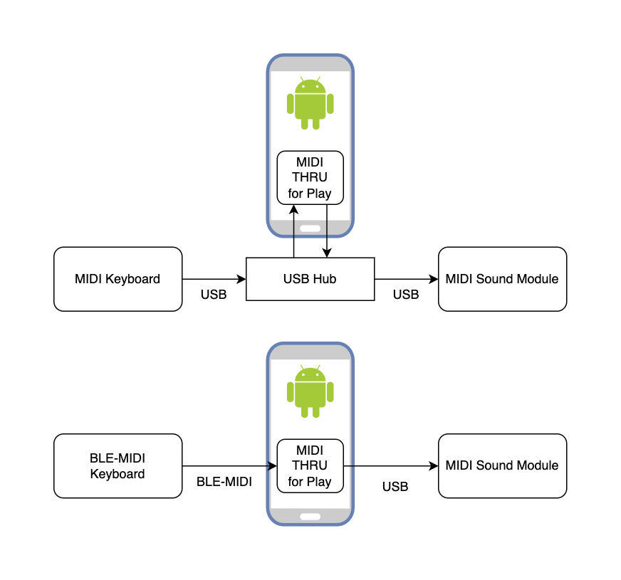

MIDI THRU 4 Play (Android App)
-----------

**このプロジェクトはまだ完成していません。 作成途中です!**

**It's in the process of being created!**

**The English explanation will be written when the program is somewhat complete.**

Android 10以上のデバイスで、MIDI鍵盤等を用いた演奏を行う際にNote On/Offなどを橋渡しするプログラムです。

THRUという名称ですが、厳密にはTHRUじゃないです。

USB-MIDIなキーボードからUSB-MIDIな音源への接続に使えます。

トランスポーズ機能のないデバイス(iRig keys 25とかウインドシンセとか)でトランスポーズして演奏できるように、と考えて作りました。

このプロジェクトは https://github.com/android/ndk-samples/tree/main/native-midi を改変しています。
(MIDI送受信部分は完全にここから流用させていただいています。)

AMidiを利用しているので、NDKが必要です。

### Hardware Setup
Android 10以上でUSB MIDIデバイスなどをつないで使います。(画像は元リポジトリより)

Screenshots
-----------
出来上がったら・・・。

Authors
-------
- mikuta0407
- pmclean@ of Android team

Support
-------
問題があれば[@mikuta0407](https://twitter.com/mikuta0407)まで。

License
-------

元ページの内容をそのまま利用しています。

Copyright 2019 Google, Inc.
Copyright 2021 mikuta0047

Licensed to the Apache Software Foundation (ASF) under one or more contributor
license agreements.  See the NOTICE file distributed with this work for
additional information regarding copyright ownership.  The ASF licenses this
file to you under the Apache License, Version 2.0 (the "License"); you may not
use this file except in compliance with the License.  You may obtain a copy of
the License at

  http://www.apache.org/licenses/LICENSE-2.0

Unless required by applicable law or agreed to in writing, software
distributed under the License is distributed on an "AS IS" BASIS, WITHOUT
WARRANTIES OR CONDITIONS OF ANY KIND, either express or implied.  See the
License for the specific language governing permissions and limitations under
the License.

